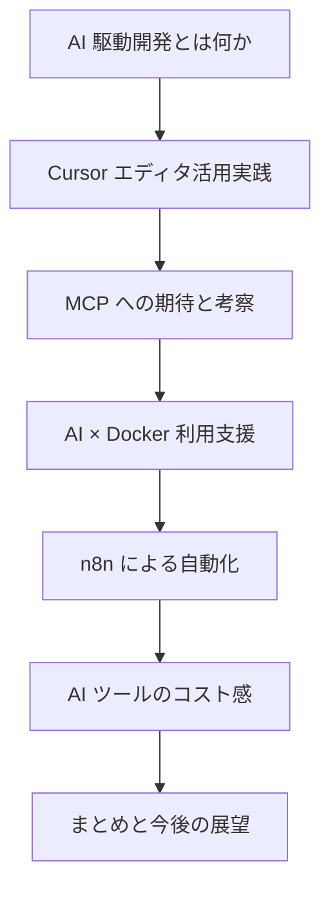

# 私のAI活用実践報告 〜Cursor・MCPを中心とした開発効率化の試み〜

> 発表者：楯   |   想定読了時間：3分

---

## はじめに

AI と開発業務の関わりについて、みなさんはどうお考えでしょうか？

本シリーズでは、私が日々 **AI ツールを活用** する中で得た知見や試行錯誤のプロセスを、プレゼン形式でまとめていきます。今回は、導入として以下の 3 点を共有します。

1. 本シリーズの目的
2. 私の自己紹介と現在地
3. 今後取り上げるトピックの概要

---

### 1. 本シリーズの目的

- **実体験ベース** で AI 活用のメリット・課題を共有し、読者のみなさんが自分の業務へ応用できるヒントを提供する。
- 特定ツールの機能紹介にとどまらず、**業務フローへの組み込み方法** を具体的に示す。

### 2. 私の自己紹介と現在地

- 楯（たて）と申します。最近はコードを書く時間よりも、AI へ情報提供・指示を出す時間の方が長くなりました。
- この記事自体も AI へ相談しながら作成しています。私は **AI との対話インターフェース** として振る舞い、AI はアウトプットを高速に生成してくれます。

  

### 3. 今後取り上げるトピック

以下の 7 つのセクションに分け、それぞれ個別のブログ記事として公開します。

---

次へ → [[1. AI駆動開発とは何か]]
