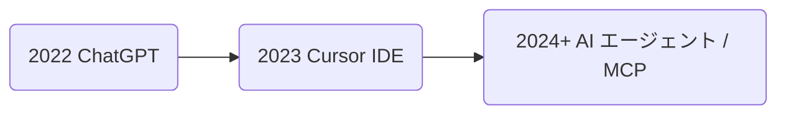

# AI 駆動開発とは何か 〜私なりの解釈と開発プロセスの変化〜

> 想定読了時間：7分

---

## 1-1. AI 登場による情報収集・問題解決の変化

### 従来型検索の課題

- キーワードの **"正確さ"** が求められ、初学者ほど検索が難しい。
- Stack Overflow・公式ドキュメント・ブログなどを **タブ大量開き** で横断する非効率。
- 解決までの **試行錯誤コスト** が高い。

  

### 対話型 AI の登場

LLM (Large Language Model) を活用した ChatGPT などの出現により、以下が大きく変わりました。

| Before | After |
|---|---|
| 曖昧な問いはヒットしにくい | **自然言語そのまま** で質問 OK |
| 解決策の候補を人が統合 | AI が **要約 & コード例** を提示 |
| 知識のギャップを本人が埋める | AI が **関連キーワード** を教えてくれる |

#### 例：Flutter UI の名前がわからないとき

> **質問例**：「Flutter で "iOS 風に全画面をスワイプで戻る" ってどうやるの？」
>
> **AI の回答イメージ**：`CupertinoNavigationBar` + `CupertinoPageRoute` を使い、`gestureEnabled` を true にするコードスニペットを提示。

  

---

## 1-2. AI の進化と開発者との関係性の現在

### ツール進化の年表

### 役割シフトの概要

- **Before**：人間がコードを詳細実装
- **After**：人間は AI を **指揮・レビュー**、AI が実装・修正

| AI が得意なこと | 人間が担うべきこと |
|---|---|
| 既存コードの修正・変換 | 新規性の高い設計・意思決定 |
| 定型タスクの自動化 | ビジネス要件の解釈 |
| テストケース生成 | プライオリティ判断 |

---

## まとめ

AI は "調べる" 行為自体を変革し、開発者は **"実装する人" から "AI をマネジメントする人"** へシフトしつつあります。次章では、その代表例として **Cursor エディタ** を用いた実践例を深掘りします。 

---

← 前へ [[0. はじめに]]  |  次へ → [[2. Cursorエディタ活用実践]] 