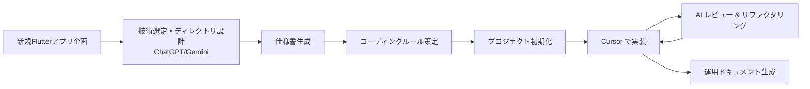

# AI 駆動開発とは何か 〜私なりの解釈と開発プロセスの変化〜

> 想定読了時間：7分

---

## AI駆動開発の定義と特徴

AI駆動開発（AI-Driven Development）とは、ソフトウェア開発プロセス全体において人工知能技術を活用し、人間の開発者とAIが協調して設計、実装、テスト、デプロイを行う開発手法です。
以下に一般的なプロセスとメリットを示します。

### 一般的なプロセス
1. 要件定義支援: AIを用いて要求仕様書の概要やユーザーストーリーを自動生成・要約
2. 設計支援: アーキテクチャ提案やコードスニペット生成・設計検討
3. 実装支援: コード補完、サンプルコード生成、リファクタリング支援
4. テスト自動化: テストケース生成、テストコード作成、CI/CDへの組み込み
5. デプロイ・運用支援: インフラ定義、ログ解析、自動スケーリング提案

### 主なメリット
- 生産性向上
- 品質改善
- ナレッジ共有の促進
- 反復的改善サイクルの高速化

---

## 1-1. 実務でのAI駆動開発体験（Flutter 新規アプリ立ち上げ事例）

私が直近の実務で経験した AI 駆動開発のワークフローを、時系列で整理します。プロジェクトは **Flutter を用いた新規モバイルアプリ** で、チーム規模は 3 名（私＋バックエンド 1 名＋デザイナ 1 名）でした。

### フェーズと具体的な AI 活用ポイント

| フェーズ | 主なやりとり相手 | AI から得たアウトプット | 人間の判断・アクション |
|---|---|---|---|
| ① 企画・技術選定 | ChatGPT / Gemini | アプリ規模・要件を伝え、推奨ディレクトリ構造・ライブラリ候補を提案 | 技術スタックの最終決定 |
| ② 仕様書作成 | ChatGPT | スクリーン一覧、API インタフェース定義を Markdown で生成 | 社内フォーマットへ一部修正 |
| ③ コーディングルール策定 | ChatGPT | Lint ルール・コミット規約・ブランチモデル案 | プロジェクト規模に合わせて取捨選択 |
| ④ プロジェクトブート | ChatGPT (Cursor 連携) | `flutter create` 後のフォルダ移動、依存パッケージ追加スクリプトを生成 | 実行・検証 |
| ⑤ 実装サイクル | Cursor (ChatGPT) | 画面仕様を渡し、クリーンアーキテクチャに沿った Dart ファイル群を自動生成 | UI 調整・コードレビュー |
| ⑥ ドキュメント整備 | ChatGPT | ライブラリ更新コマンド一覧、CI/CD 手順書を生成 | Confluence へ転記 |

### ワークフロー

このループを **1 画面 / 1 API ごと** に繰り返すことで、

#### 得られた学び
- **ドキュメント先行**：AI へ適切にプロンプトを渡すには、仕様とルールを明文化することが最重要。
- **生成物の即時レビュー**：AI が出力したコードや手順をすぐ動かし、フィードバックを返すと精度が上がる。
- **AI の"癖"を知る**：ライブラリの最新バージョンに追従しているか等、人間側でのダブルチェックは欠かせない。

---

## 1-2. AI 登場による情報収集・問題解決の変化

### 従来型検索の課題

- キーワードの **"正確さ"** が求められ、初学者ほど検索が難しい。
- Stack Overflow・公式ドキュメント・ブログなどを **タブ大量開き** で横断する非効率。
- 解決までの **試行錯誤コスト** が高い。

### 対話型 AI の登場

LLM (Large Language Model) を活用した ChatGPT などの出現により、以下が大きく変わりました。

| Before | After |
|---|---|
| 曖昧な問いはヒットしにくい | **自然言語そのまま** で質問 OK |
| 解決策の候補を人が統合 | AI が **要約 & コード例** を提示 |
| 知識のギャップを本人が埋める | AI が **関連キーワード** を教えてくれる |

#### 例：Flutter UI の名前がわからないとき

> **質問例**：「Flutter で "iOS 風に全画面をスワイプで戻る" ってどうやるの？」
>
> **AI の回答イメージ**：`CupertinoNavigationBar` + `CupertinoPageRoute` を使い、`gestureEnabled` を true にするコードスニペットを提示。

  

---

## 1-3. AI の進化と開発者との関係性の現在

### ツール進化の年表

### 役割シフトの概要

  

| AI が得意なこと | 人間が担うべきこと |
|---|---|
| 既存コードの修正・変換 | 新規性の高い設計・意思決定 |
| 定型タスクの自動化 | ビジネス要件の解釈 |
| テストケース生成 | プライオリティ判断 |

---

## まとめ

AI は "調べる" 行為自体を変革し、開発者は **"実装する人" から "AI をマネジメントする人"** へシフトしつつあります。次章では、その代表例として **Cursor エディタ** を用いた実践例を深掘りします。

---

← 前へ [[0. はじめに]]  |  次へ → [[2. Cursorエディタ活用実践]]