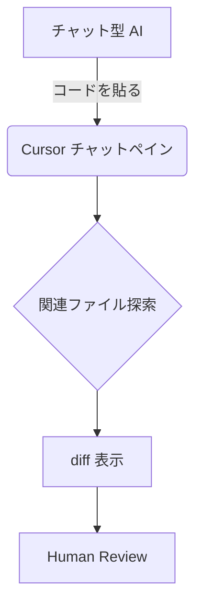

# Cursor エディタ活用実践 〜私の試行錯誤と現時点での評価〜

> 想定読了時間：10分

---

## 2-1. 導入の経緯と主な利用機能

### なぜ Cursor？

1. **ChatGPT へのコピペ疲れ** からの解放
2. プロジェクト全体を AI が把握し、**関連ファイルを横断** して修正してくれる期待
3. VSCode ベースでありながら、**AI エージェントモード** を独自搭載



### エージェントモードの実際

1. プロンプト欄へタスクを入力
2. AI が **思考プロセス**（step1, step2...）をチャットに表示
3. 関連ファイルを自動で開き、修正案を適用
4. `git diff` 形式で差分を提示 → **人間がレビュー & 承認**

<div align="center">
  
</div>

---

## 2-2. プロンプトエンジニアリングの工夫

| 良いプロンプト例 | 改善が必要な例 |
|---|---|
| 「`package.json` の `react` を 18.2.0 にアップグレードし、関連する import 書き換えを自動で行ってください。変更理由をコメントで残してください。」 | 「React を最新にして！」 |
| Thinking MCP を使い **手順を箇条書きで** 考えさせる | 具体的ファイル名なし、スコープ不明 |

> **ポイント**：`コスト = リクエスト数 × コンテキスト長` を意識し、**最小限の API 呼び出し回数** で最大効果を狙う。

---

## 2-3. ドキュメント戦略と Cursor ルールファイル

### Docs フォルダの Markdown

- 各ファイルごとに
  - 目的
  - 主要関数
  - 依存ライブラリ
  - **AI への指示コメント**
- Git でバージョン管理し、Obsidian で閲覧 → 人 & AI 両方に優しい

### `.cursorrule` 例

```jsonc
{
  "projectName": "awesome-project",
  "architecture": "Clean Architecture",
  "codingStyle": "Airbnb",
  "exclude": ["node_modules/", "*.env", "*.log"]
}
```

---

## 2-4. 現状の制約と私の評価

- VSCode 純正拡張の一部が動かないケース
- 非英語プロジェクトでの **AI 理解度** にはまだムラ
- それでも、**総合的な生産性向上** は体感 20〜30% 以上

> **結論**：Cursor は「AI ファースト IDE」への第一歩として非常に魅力的。ただし **レビュー工程の自動化** など、まだ伸びしろも大きい。

---

← 前へ [[1. AI駆動開発とは何か]]  |  次へ → [[3. MCPへの期待と考察]]