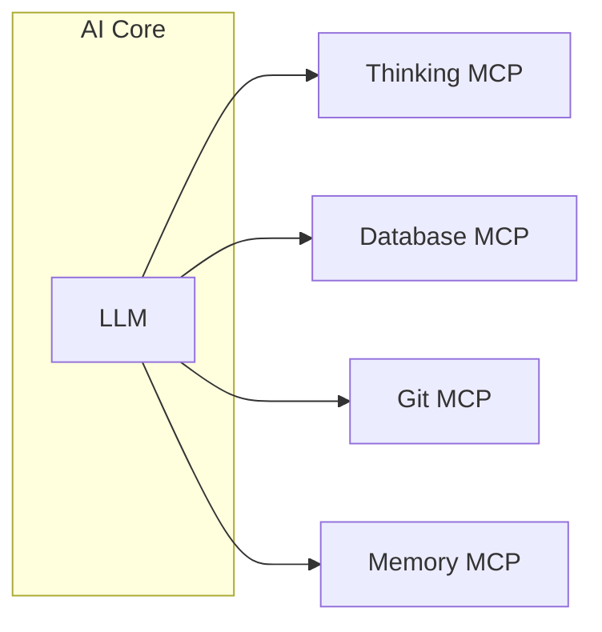

# MCP への期待と考察 〜AI エージェント能力拡張の可能性〜

> 想定読了時間：6分

---

## 3-1. MCP とは何か？

- **Model Context Protocol** の略。
- AI がプラグインのように **外部モジュール**（Git, Database, Memory など）へアクセスするための統一インターフェースを提供。
- 複数の AI モデル間で **共通仕様** として機能することで、再利用性を高めることが期待される。

<iframe height="400" src="https://www.youtube.com/embed/48PYAUT5dVQ" title="知らないとヤバイ!?いま話題のMCPを1分でスッキリ解説 #ai #mcp #仕事効率化 #ai活用術" frameborder="0" allow="accelerometer; autoplay; clipboard-write; encrypted-media; gyroscope; picture-in-picture; web-share" referrerpolicy="strict-origin-when-cross-origin" allowfullscreen></iframe>

---

## 3-2. MCP がもたらす拡張性

| MCP モジュール | 付与される能力 | 具体例 |
|---|---|---|
| Thinking | 段階的思考、タスク分解 | `Chain-of-Thought` を外部化し、軽量モデルでも多段思考が可能に |
| Database | 構造化データの CRUD | SQLite / Supabase などへの直接問い合わせ |
| Git | リポジトリ操作 | ブランチ作成、PR 作成、コミットメッセージ生成 |
| Memory | 永続的な会話履歴 | 長期プロジェクトでのコンテキスト保持 |

---

## 3-3. Thinking MCP のコストメリット
> **LLMのThinking機能とは**
> - LLMにおけるThinking機能は、モデルがChain-of-Thoughtを通じて内部で多段推論を行い、複雑な課題を段階的に解決する能力を指す。
>
> 詳細な解説：https://zenn.dev/kimkiyong/articles/c3e22e814dab8a

- Thinking専用LLMは高コストになりがちだが、Thinking MCPサーバーを介して呼び出せば、任意のモデルでThinking機能を利用可能。
- 通常は低コストな汎用モデルにリクエストを送り、思考が必要な場面でのみThinking MCPを呼び出すことで、モデル単価を抑制できる。
- これにより、**ランニングコスト抑制**＆**柔軟なスケーリング**を実現。

---

## 3-4. 運用形態：クラウド vs ローカル

| 観点 | クラウドホスト | ローカル Docker |
|---|---|---|
| 導入の容易さ | ◎ | △ (イメージ作成が必要) |
| レイテンシ | △ (依存) | ◎ (localhost) |
| スリープ影響 | あり | なし |
| 機密データ | 外部送信の懸念 | 社内ネットワークで完結 |

> **補足**: Smitheryでは、MCPサーバーをクラウド上でホストし、簡単に利用できるサービスが提供されています。詳細は[Smithery](https://smithery.ai/)をご覧ください。

> **所感**：API ベースでない機能（Git, ファイル I/O 等）が中心となる MCP では、**ローカルホスト運用** が特に相性が良い。

---
← 前へ [[2. Cursorエディタ活用実践]]  |  次へ → [[4. AIによるDocker利用支援]]