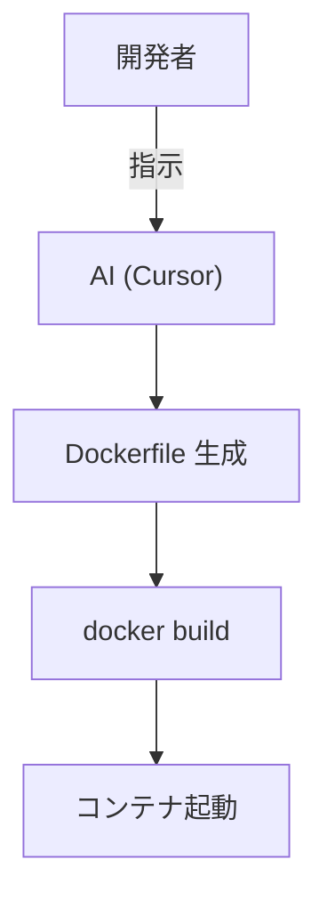

# AI による Docker 利用支援 〜環境構築の手間を軽減する〜

> 想定読了時間：5分

---

## 4-1. Docker のメリットと従来の導入ハードル

| メリット | 従来のハードル |
|---|---|
| 環境差異を吸収 | `Dockerfile` 記述が複雑 |
| 再現性の高いビルド | CLI コマンド習得が必須 |
| CI/CD との親和性 | イメージ容量・キャッシュ管理 |

---

## 4-2. AI がもたらす導入支援

1. **Dockerfile 自動生成**（例：Cursor で「このプロジェクトを Docker 化して」と指示）
2. 主要コマンド (`docker compose up -d` など) の **自動ドキュメント化**
3. **エラー解決** をチャットで即時フィードバック

---

## 4-3. チーム開発におけるメリット

- 全員が **同一コンテナ** で動作 → 「動く／動かない」論争から解放
- AI がコンテナ内を前提にプロンプト処理 → **環境前提の誤解** を削減
- `.cursorrule` にカスタム Docker コマンドを記述し、**AI と人間のナレッジ共有** を実現

> **補足**：Docker Image を GitHub Container Registry などに置けば、新人も `docker pull` だけで即戦力！

---
← 前へ [[3. MCPへの期待と考察]]  |  次へ → [[5. n8nによる自動化の試み]]