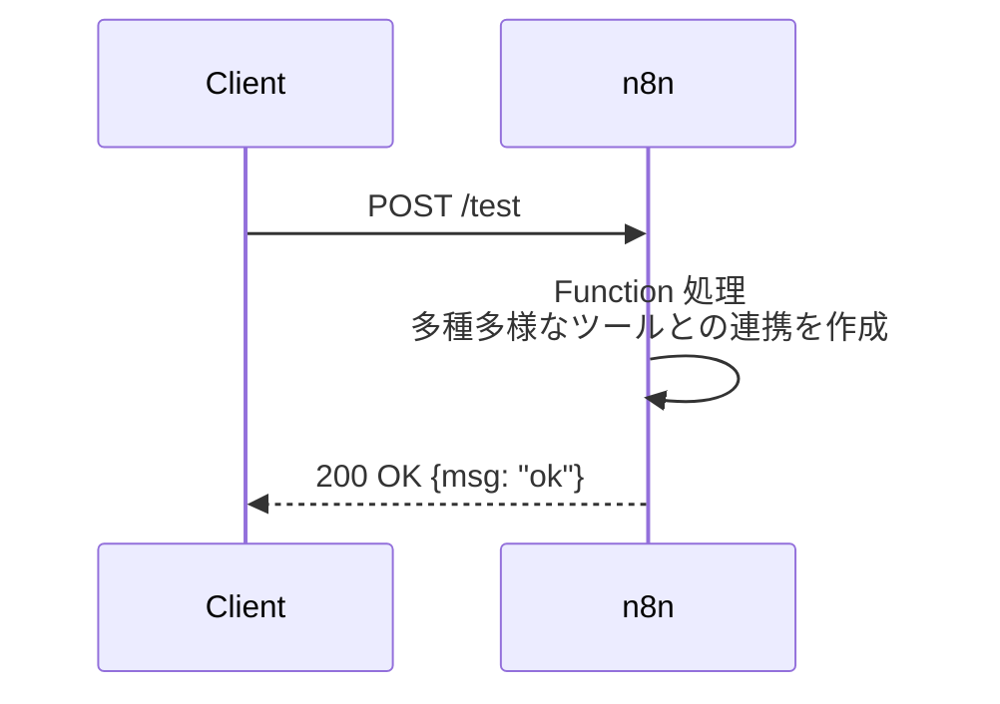

# n8n による自動化の試みと評価

> 想定読了時間：6分

---

## 5-1. 導入動機と第一印象

- **AI 連携ノード** をノーコードで試せる
- **Webhook** による擬似 API サーバとして活用可能
- オープンソース & ローカルホストで **無料運用**

---

## 5-2. 具体的な活用例

### サンプル：ローカルテスト API

1. `Webhook` ノードで POST 受信
2. `Function` ノードで簡易処理 (`return {msg: "ok"}`)
3. `Respond to Webhook` ノードで JSON 返却

### 定型タスクのトリガー設定

- **Schedule**：定期バッチ
- **Slack**：メンションで自動返信
- **IFTTT 代替** として各種 API を連携

---

## 5-3. 適用範囲と限界

| n8n が向くタスク | コード開発が向くタスク |
|---|---|
| シンプル & 定型フロー | 複雑 & ステートフル処理 |
| プロトタイプ API | 大規模プロダクション API |
| ノーコード自動化 | 厳密な型・テストが必須 |

> **所感**：n8n は「まず動くもの」を素早く試すのに最適。ただし拡張が進むと、**コードベース＋AI 開発** へ移行する判断も必要。

---
← 前へ [[4. AIによるDocker利用支援]]  |  次へ → [[6. AIツール利用コストと費用対効果]]