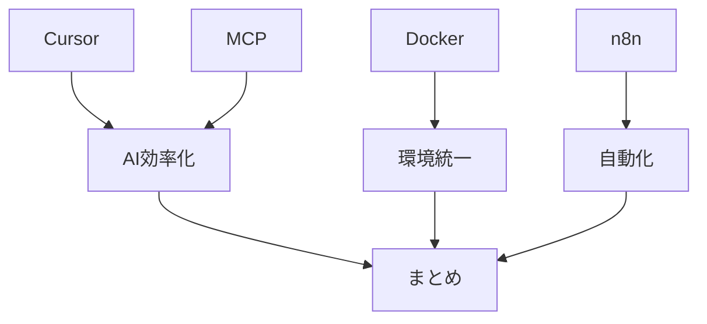

# まとめと今後の展望

> 想定読了時間：4分

---

## 本日の総括

- **Cursor**：IDE 統合型 AI のポテンシャルと課題
- **MCP**：AI 能力のモジュール化による拡張性
- **Docker & n8n**：環境構築・自動化における AI の実用性
- **コスト**：時間短縮による ROI をどう測るか

---

## 私の提案（行動喚起）

1. まずは **小規模なタスク** で AI ツールを試す
2. 成果が出たら **ドキュメント & ルール化** してチームへ展開
3. コストは **効果測定 → 段階的導入** の順で

---

## 今後の展望

- **AI × DevOps**：CI/CD パイプラインへのエージェント統合
- **メモリ拡張**：長期プロジェクトでの AI コンテキスト永続化
- **リスクマネジメント**：AI ガバナンスとセキュリティ体制の整備

  

> ご清聴ありがとうございました！

---
← 前へ [[6. AIツール利用コストと費用対効果]]