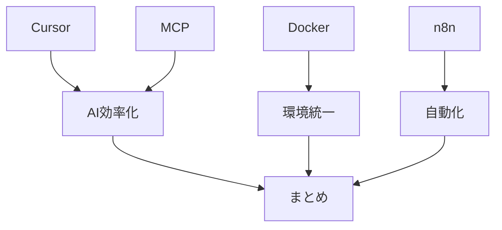

# まとめと今後の展望

> 想定読了時間：4分

---

## 本日の総括

- **Cursor**：IDE 統合型 AI のポテンシャルと課題
- **MCP**：AI 能力のモジュール化による拡張性
- **Docker & n8n**：環境構築・自動化における AI の実用性
- **コスト**：時間短縮による ROI をどう測るか

---

## 私の提案（行動喚起）

1. まずは **小規模なタスク** で AI ツールを試す
2. 成果が出たら **ドキュメント & ルール化** してチームへ展開
3. コストは **効果測定 → 段階的導入** の順で

---

## 今後の展望

### Devin型AI（自律型・バックグラウンド自動タスクAI）の台頭

2025年5月、Devinのような「AIがバックグラウンドで自律的にタスクを実行する」エージェント型AIが各社から本格リリースされ、開発現場の生産性やワークフローが大きく変革しつつあります。

- **OpenAI Codex（2025年5月発表）**：クラウド上で複数タスクを並列実行し、強化学習で進化。CLIやAPI、GitHub連携も強化され、反復作業の自動化や開発者の生産性向上に寄与。
- **Cursor（v0.50, 2025年5月）**：新たに「Background Agent」機能を搭載し、丸投げAI・並列タスク・GitHub連携・複数タブ同時実行を実現。実際の開発フローに深く統合されている。
- **Jules（Google, 2025年5月）** JulesはGitHubに接続し、ソースコードを読み込んだ上で、人間がタスクを与えると実装計画を立てた上でコードの変更や生成を行い、作業の結果をコードと共に報告してくれます。

これらのAIは「人が作業している間にAIが裏で自律的に別タスクを進める」体験を実現し、今後はより高度な自律性・協調性・安全性・拡張性が求められます。

> **Devinについて**：
> <iframe width="600" height="300" src="https://www.youtube.com/embed/_gC1tLjW0To" title="【愛してる】Devinは本当に最高の開発パートナーになり得ます！徹底解説8選！活用のメリットは？実際使っているガチの感想" frameborder="0" allow="accelerometer; autoplay; clipboard-write; encrypted-media; gyroscope; picture-in-picture; web-share" referrerpolicy="strict-origin-when-cross-origin" allowfullscreen></iframe>

### 競争と今後の進化

- 主要AI企業による「エージェント戦争」が激化。今後も新たなAIエージェントや機能が続々登場する見込み。
- 開発現場では「AIと人間の協働」が当たり前となり、AIが自律的に提案・実装・テスト・ドキュメント化まで担う時代へ。
- セキュリティ・ガバナンス・コスト最適化・AIの説明責任など新たな課題も浮上。

### 会社で使えるかは微妙

GitHub連携が前提なサービスばかりなので、GitHubにソースを置く必要がある。
ローカルホストGitLabや、Backlog等のGitが使えるようにならないと厳しそう。

---

> ### ご清聴ありがとうございました！

Devin使ってみたい方は、下記URLから利用開始していただけると、私とあなたの両方に約$10分のクレジットが追加されます！

https://app.devin.ai/invite/6o4bRoJ8fZGSV3Or

  

---
← 前へ [[6. AIツール利用コストと費用対効果]]