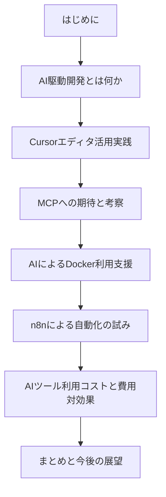

# 私のAI活用実践報告

> AI駆動開発とCursorエディタを中心とした開発効率化に関する実践レポート

## 📚 このリポジトリについて

このリポジトリは、AI技術を活用した開発効率化の実践報告を[Obsidian](https://obsidian.md/)形式でまとめたものです。Obsidianはマークダウンベースのナレッジマネジメントツールで、ドキュメント間のリンクやグラフビュー機能を活用して情報を有機的に繋げることができます。

## 📖 コンテンツ構成

本報告書は以下の章で構成されています：

1. [はじめに](0.%20はじめに.md)
2. [AI駆動開発とは何か](1.%20AI駆動開発とは何か.md)
3. [Cursorエディタ活用実践](2.%20Cursorエディタ活用実践.md)
4. [MCPへの期待と考察](3.%20MCPへの期待と考察.md)
5. [AIによるDocker利用支援](4.%20AIによるDocker利用支援.md)
6. [n8nによる自動化の試み](5.%20n8nによる自動化の試み.md)
7. [AIツール利用コストと費用対効果](6.%20AIツール利用コストと費用対効果.md)
8. [まとめと今後の展望](7.%20まとめと今後の展望.md)

## 🔍 Obsidianでの閲覧方法

### Obsidianのインストール

1. [Obsidian公式サイト](https://obsidian.md/)からお使いのOSに合わせたバージョンをダウンロード・インストールしてください
2. Obsidianを起動し、「保管庫を開く」を選択
3. このリポジトリをクローンまたはダウンロードしたフォルダを選択

### 基本的な使い方

- **ナビゲーション**: 左側のファイルエクスプローラから各ファイルを選択するか、ドキュメント内の`[[ファイル名]]`形式のリンクをクリックして移動できます
- **グラフビュー**: 左側のサイドバーにある「グラフビュー」アイコンをクリックすると、ドキュメント間の関係性を視覚的に確認できます
- **検索**: `Ctrl+F`（Windows）または`Cmd+F`（Mac）でドキュメント内検索、`Ctrl+Shift+F`または`Cmd+Shift+F`で全文検索が可能です
- **バックリンク**: 右側のサイドバーで「バックリンク」パネルを開くと、現在のドキュメントを参照している他のドキュメントを確認できます

### Mermaidグラフの表示

本ドキュメントには`mermaid`記法で書かれた図表が含まれています。Obsidianはデフォルトでmermaidをサポートしているため、追加の設定なしで図表が表示されます。

## 🔗 推奨プラグイン

Obsidianの機能を拡張するために、以下のプラグインの導入を推奨します：

1. **Calendar** - 日付ベースのナビゲーション向上
2. **Dataview** - データの集計・可視化
3. **Kanban** - タスク管理
4. **Excalidraw** - 図表作成

プラグインは設定→サードパーティプラグイン→コミュニティプラグインを閲覧から検索・インストールできます。

## 📝 カスタマイズ方法

- **テーマ変更**: 設定→外観→テーマから変更可能
- **フォント設定**: 設定→外観→フォントから変更可能
- **ホットキー**: 設定→ホットキーから各操作のショートカットをカスタマイズ可能

## 💡 ヒント

- **モバイル版Obsidian**: iOS/Android向けアプリも提供されており、[Obsidian Sync](https://obsidian.md/sync)（有料）を使用することでデバイス間の同期が可能です
- **グラフビュー設定**: グラフビューの表示オプションをカスタマイズすることで、ドキュメント間の関係性をより分かりやすく可視化できます
- **読書モード**: 編集中のドキュメントの右上にあるプレビューボタンをクリックすることで、読書モードに切り替えられます

## 📢 フィードバック

本ドキュメントに関するフィードバックや質問がありましたら、Issueを作成してお知らせください。